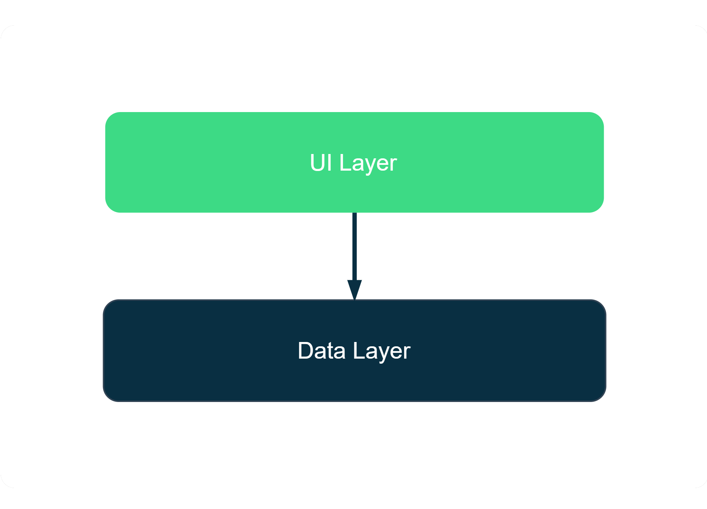
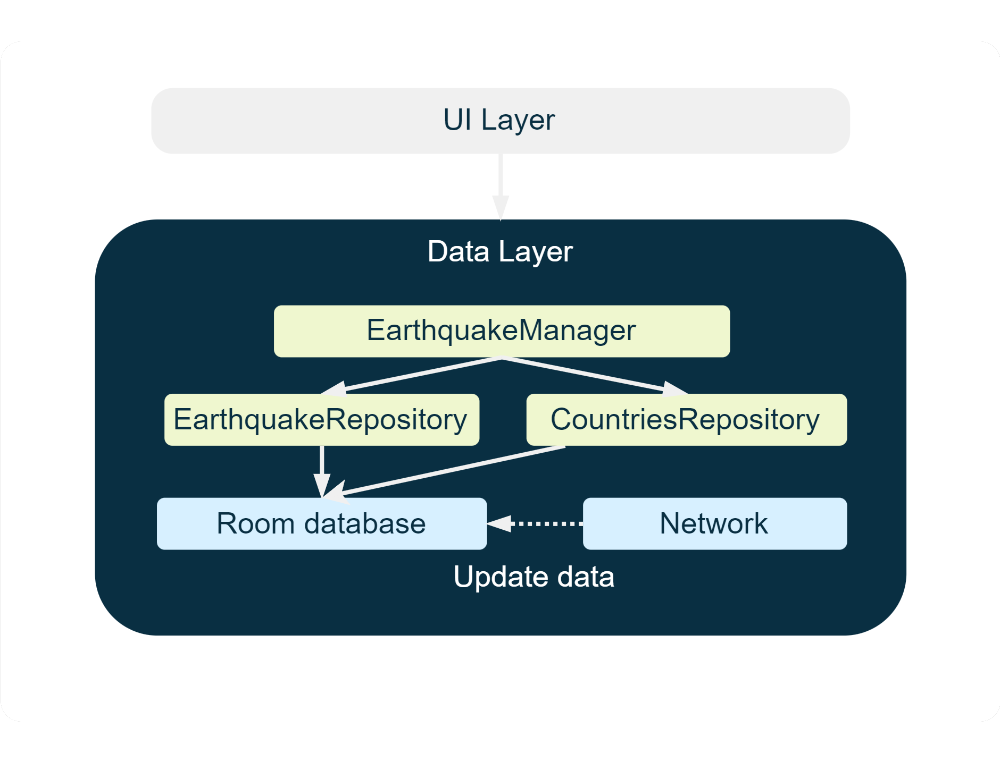

# <p align="center">Quakes<p>
✨**Quakes** demonstrates modern Android development with Google Maps SDK, Firebase, Hilt, Coroutines, Flows, Jetpack libraries (Navigation component, Room, ViewModel, Paging3) based on MVVM architecture.

## Screenshots


<a href="https://play.google.com/store/apps/details?id=com.asemlab.quakes"></a>


## Features

🌐 Global Coverage: Stay informed about earthquakes happening worldwide. Track magnitude, depth, and location with detailed maps and reports.

📅 Historical Data: Access a comprehensive earthquake archive dating back to 1960., helping you analyze patterns and trends over time.

## Tech stack & Open-source libraries

- Minimum SDK level 22
- [Kotlin](https://kotlinlang.org/) based, [Coroutines](https://developer.android.com/kotlin/coroutines) + [Flow](https://developer.android.com/kotlin/flow) for asynchronous.
- Jetpack
  - [Lifecycle](https://developer.android.com/jetpack/androidx/releases/lifecycle): Performs actions in response to a change in the lifecycle status of another component, such as activities and fragments.
  - [ViewModel](https://developer.android.com/topic/libraries/architecture/viewmodel): Exposes state to the UI and encapsulates related business logic. Its principal advantage is that it caches state and persists it through configuration changes.
  - [DataBinding](https://developer.android.com/jetpack/androidx/releases/databinding): Binds UI components in your layouts to data sources in your app using a declarative format rather than programmatically.
  - [Navigation](https://developer.android.com/guide/navigation): Helps you implement navigation, from simple button clicks to more complex patterns, such as app bars and the navigation drawer.
  - [Room](https://developer.android.com/jetpack/androidx/releases/room): Provides an abstraction layer over SQLite to allow for more robust database access while harnessing the full power of SQLite.
  - [Hilt](https://developer.android.com/training/dependency-injection/hilt-android): For dependency injection.
  - [Paging3](https://developer.android.com/topic/libraries/architecture/paging/v3-overview): Helps you load and display pages of data from a larger dataset from local storage or over a network.
- Architecture
  - MVVM Architecture (View - DataBinding - ViewModel - Model)
  - Repository Pattern
- [Google Maps utils](https://github.com/googlemaps/android-maps-utils): Contains utilities that are useful for a wide range of applications using the [Google Maps SDK for Android](https://developers.google.com/maps/documentation/android-sdk). Used to customize Marker icon & clustring.
- [Google play In-App update](https://developer.android.com/guide/playcore/in-app-updates): prompts active users to update your app.
- [Firebase Cloud Messaging](https://firebase.google.com/docs/cloud-messaging): Sends notification messages to client app.
- [Retrofit2](https://square.github.io/retrofit) & [OkHttp3](https://square.github.io/okhttp/): A type-safe HTTP clients for Android and Java.
- [Gson](https://github.com/google/gson): A Java serialization/deserialization library to convert Kotlin Objects into JSON and back.
- [Gradle’s Kotlin DSL](https://developer.android.com/build/migrate-to-kotlin-dsl): Provides an alternative syntax to the traditional Groovy DSL with an enhanced editing experience in Android Studio.
- [Material-Components](https://github.com/material-components/material-components-android): Enables a reliable development workflow to build beautiful and functional Android apps.
- [Glide](https://github.com/bumptech/glide): Is a fast and efficient open source media management and image loading framework for Android.
- [UtilCode](https://github.com/Blankj/AndroidUtilCode): Is a powerful & easy to use library for Android. This library encapsulates the functions that commonly used in Android development.
- [Coil](https://coil-kt.github.io/coil/): An image loading library for Android backed by Kotlin Coroutines. Used to load svg images from network.
- [Splash screen API](https://developer.android.com/develop/ui/views/launch/splash-screen): lets apps launch with animation, including an into-app motion at launch, a splash screen showing your app icon, and a transition to your app itself.

## Architecture

**Quakes** is based on the MVVM architecture and the Repository pattern, which follows the [Google's official architecture guidance](https://developer.android.com/topic/architecture).

The overall architecture is composed of two layers, the **UI layer** and the **data layer**. Each layer is made up of multiple components, each with different responsibilities.



### UI Layer


The role of the UI is to display the application data on the screen and also to serve as the primary point of user interaction. Whenever the data changes, either due to user interaction (like pressing a button) or external input (like a network response), the UI should update to reflect those changes.

It consists of two components:
- **UI elements**: activities and fragments that display the data.
- **State holders**: the classes that are responsible for the production of UI state and contain the necessary logic for that task, such as ViewModel.

### Data Layer



It contains application data and business logic. The business logic is what gives value to the app — it's made of real-world business rules that determine how application data must be created, stored, and changed.

The data Layer consists of EarthquakeManager which in turn contains two repositories:
- **EarthquakesRepo**: Queries event data from the local database and requesting remote data from the network.
- **CountriesRepo**:  Queries countries data, such as name, and flag, from the local database and requesting remote data from the network.


## Modularization


**Quakes** is developed with multi-modules according to [Google's official modularization guidance](https://developer.android.com/topic/modularization), which has the following benefits: 

- Improve maintainability
- Improve quality
- Reusability
- Encapsulation
- Testability
- Build time


## Open API

**Quakes** using the following APIs:

- United States Geological Survey [USGS](https://www.usgs.gov/): Provides real-time data on earthquakes worldwide, including information such as magnitude, location, and time of the event.
- [restcountries](https://gitlab.com/restcountries/restcountries): Provides information about countries such as flag, population, and currency.

## License
```xml
Designed and developed by 2023 AsemLab (Asem Abu Alrub)

Licensed under the Apache License, Version 2.0 (the "License");
you may not use this file except in compliance with the License.
You may obtain a copy of the License at

   http://www.apache.org/licenses/LICENSE-2.0

Unless required by applicable law or agreed to in writing, software
distributed under the License is distributed on an "AS IS" BASIS,
WITHOUT WARRANTIES OR CONDITIONS OF ANY KIND, either express or implied.
See the License for the specific language governing permissions and
limitations under the License.
```
